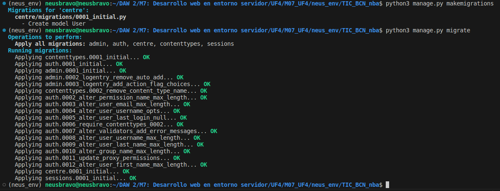
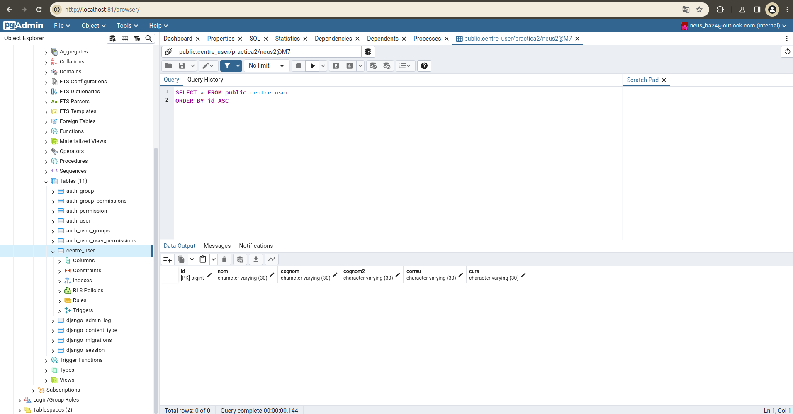
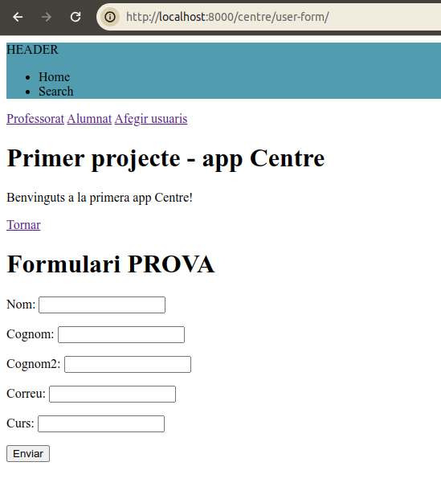
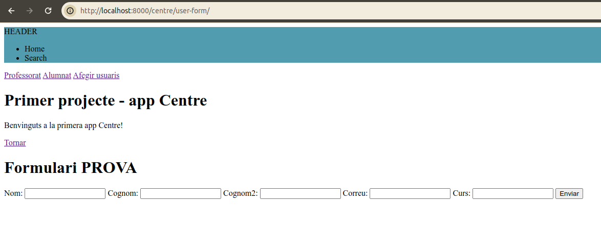

# README
## Capturas de pantalla

### Teachers

### Students

# PRÀCTICA 2 - BBDD
## Captura comandos migración
### (Los vídeos estan en la carpeta "capturas")

# PRÀCTICA 3 - FORMULARI
## Captura formularios con/sin .as_p
### Con .as_p

### Sin .as_p

